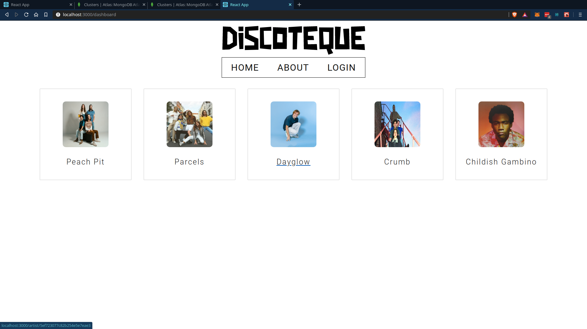
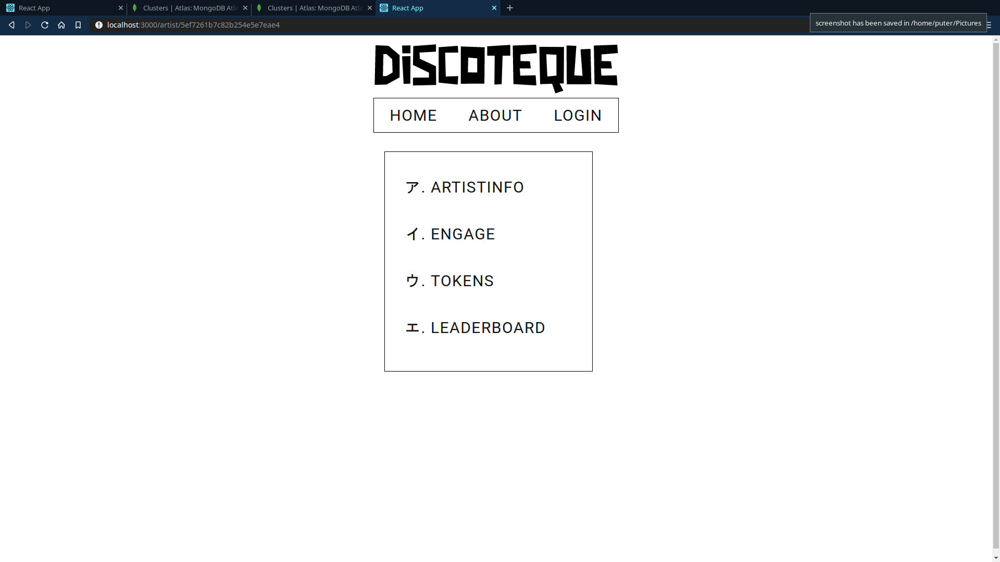
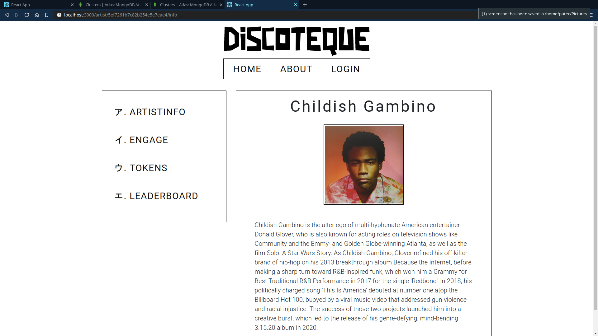
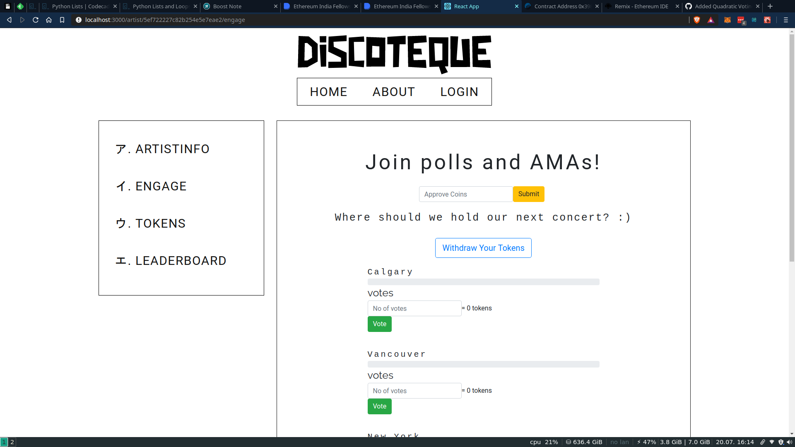

# Discoteque
### Done as part of Ethereum India Fellowship 2020.
---
## Idea
A platform for small-time artists to interact with their fans.

## Brief Description
* Artists can create polls and AMAs on the website. 
* Users can participate in these using ERC-20 tokens issued by the platform.
* ERC-20 tokens are distributed according to the user's [Last.fm](https://www.last.fm/home) profile.
* Last.fm is a scrobbling service, the user can connect any of their music streaming account including Spotify, Apple Music, Amazon Music etc.
 Eg- [My last.fm profile](https://www.last.fm/user/nar-d_d-awg)  
* The amount of token issued depends on the user's listening history of a particular artist.
* This unique ability to interact with your favourite artists drives people to collect tokens by listening to more songs, increasing sales for the artist on streaming services.

## Implementation
* Front-end using ReactJS
* Back-end using NodeJS, MongoDB Atlas & Ethereum

## Smart Contracts
1. ERC20 Contract -
    * Gorli - [0xa11dAcA6c020c3b71ce4CE22823F2397341D3784](https://goerli.etherscan.io/address/0xa11dAcA6c020c3b71ce4CE22823F2397341D3784#code)  
2. Facory Contract
    * Gorli - [0x482829ba989fbc368f9a89dff56cdf4036f39f28](https://goerli.etherscan.io/address/0x482829ba989fbc368f9a89dff56cdf4036f39f28#code)

## Screenshots
### Main Screen

### Artist Screen

### Artist Screen -> ArtistInfo

### Engage Screen
